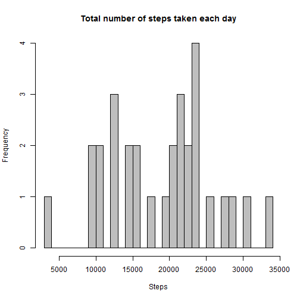

## Loading and preprocessing the data

1. Load the data

```r
activity <- read.csv(file="activity.csv")
```

2. Process/transform the data 


```r
activity$dat <- as.Date(activity$date)
activity$day <- format(activity$dat,"%d")
```


## What is mean total number of steps taken per day?

For this part of the assignment, you can ignore the missing values in the dataset.

```r
good <- complete.cases(activity)
act1 <- activity[good,]
```

1. Calculate the total number of steps taken per day


```r
res1 <- tapply(act1$steps,act1$day,sum)
```

2. Make a histogram of the total number of steps taken each day

```r
hist(res1,breaks=30,col="grey",xlab="Steps",
    main="Total number of steps taken each day")
```

 


3. Calculate and report the mean and median of the total number of steps taken per day

```r
st.mean <- mean(res1)
st.median <- median(res1)
```

- Mean total steps taken per day : 19020
- Median total steps taken per day: 20598

## What is the average daily activity pattern?

1. Make a time series plot (i.e. type = "l") of the 5-minute interval (x-axis) and the average number of steps taken, averaged across all days (y-axis)


```r
aa <- aggregate.data.frame(activity$steps, by=list(activity$interval),
  	FUN=mean, na.rm=T)
colnames(aa) <- c("interval","steps")
plot(aa,type="l")
```

 

2. Which 5-minute interval, on average across all the days in the dataset, contains the maximum number of steps?


```r
m1 <- aa[aa$steps==max(aa$steps),]
```
The maximum number of steps per interval is 206 and corresponds to the interval 835. 

## Imputing missing values

The presence of missing days may introduce bias into some calculations or summaries of the data.

1. Calculate and report the total number of missing values in the dataset (i.e. the total number of rows with NAs)

```r
mv <- is.na(activity$steps)
```
There are 2304 rows with missing values.

2. Devise a strategy for filling in all of the missing values in the dataset. 


```r
# Mean for interval is in 'aa' data.frame.
head(aa)
```

```
##   interval     steps
## 1        0 1.7169811
## 2        5 0.3396226
## 3       10 0.1320755
## 4       15 0.1509434
## 5       20 0.0754717
## 6       25 2.0943396
```

3. Create a new dataset that is equal to the original dataset but with the missing data filled in.


```r
act2 <- activity
act2[mv,1] <- aa$steps[aa$interval %in% act2$interval]
summary(act2$steps)
```

```
##    Min. 1st Qu.  Median    Mean 3rd Qu.    Max. 
##    0.00    0.00    0.00   37.38   27.00  806.00
```

```r
head(act2)
```

```
##       steps       date interval        dat day
## 1 1.7169811 2012-10-01        0 2012-10-01  01
## 2 0.3396226 2012-10-01        5 2012-10-01  01
## 3 0.1320755 2012-10-01       10 2012-10-01  01
## 4 0.1509434 2012-10-01       15 2012-10-01  01
## 5 0.0754717 2012-10-01       20 2012-10-01  01
## 6 2.0943396 2012-10-01       25 2012-10-01  01
```

4. Make a histogram of the total number of steps taken each day and Calculate and report the mean and median total number of steps taken per day. Do these values differ from the estimates from the first part of the assignment? What is the impact of imputing missing data on the estimates of the total daily number of steps?


```r
res2 <- tapply(act2$steps,act2$day,sum)
hist(res2,breaks=30,col="grey",xlab="Steps",
  main="Total number of steps taken each day")
```

 

```r
st.mean2 <- round(mean(res2),0)
st.median2 <- round(median(res2),0)
```
- New Mean total steps taken per day : 21185
- New Median total steps taken per day: 21641

New mean and median are slightly larger in value compared to old values.

## Are there differences in activity patterns between weekdays and weekends?

Use the dataset with the filled-in missing values for this part.

1. Create a new factor variable in the dataset with two levels - "weekday" and "weekend" indicating whether a given date is a weekday or weekend day.

```r
day.type <- weekdays(act2$dat,abbreviate = T)
day.type <- ifelse(test = day.type %in% c("dom","sáb"),yes = "weekend","weekday")
act2$day.type <- as.factor(day.type)
summary(act2$day.type)
```

```
## weekday weekend 
##   12960    4608
```

2. Make a panel plot containing a time series plot (i.e. type = "l") of the 5-minute interval (x-axis) and the average number of steps taken, averaged across all weekday days or weekend days (y-axis). 


```r
panel <- aggregate.data.frame(act2$steps, by = list(act2$interval,act2$day.type),
                                      FUN = mean,na.rm = T)
colnames(panel) <- c("interval","day.type","steps") 

library(lattice)
xyplot(steps ~ interval | day.type, data = panel,type = "l",layout = c(1,2),,main = "Average number of steps taken")
```

 
